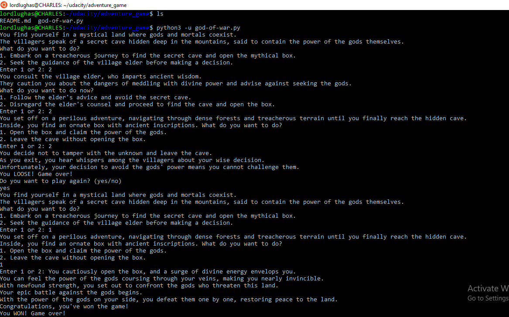

# Adventure Game created with Python

Welcome to the Adventure Game, a text-based interactive game written in Python! In this game, you will embark on a mystical journey in a land where gods and mortals coexist. Your choices will shape your destiny, and you may encounter unexpected challenges along the way. The game is played on a command line interface(CLI)

## How to Play

1. To start the game, run the Python script `python -u adventure_game.py` in your preferred Python environment.

2. Follow the on-screen instructions to make choices by entering "1" or "2" at various decision points in the story.

3. Your decisions will determine the outcome of your adventure.

4. Be prepared for randomness: Some events have unpredictable outcomes.

5. After completing the adventure, you will have the option to play again or exit the game.

## Features

- Engaging storyline with multiple paths and outcomes.
- Random events to keep the gameplay unpredictable.
- Option to replay the game for different experiences.

## Dependencies

- Python 3.x (Python 3.7 or higher recommended)

## Getting Started

1. Clone or download this repository to your local machine.

2. Open your terminal or command prompt.

3. Navigate to the directory where you have downloaded or cloned the game files.

4. Run the game by executing the following command:

5. Enjoy the adventure!

## License

This project is licensed under the MIT License - see the [LICENSE](https://github.com/lordlughas/adventure_game/blob/main/LICENSE) file for details.

## Acknowledgments

- Inspired by classic text-based adventure games.
- Developed as a fun project by [Charles Lughas](https://www.github.com/lordlughas).

Feel free to customize and expand upon this game as you wish. Have a great time playing and coding your adventure game!

